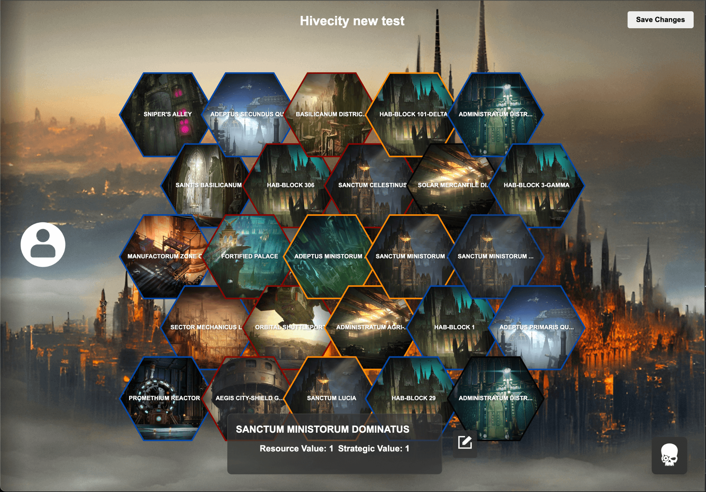

# Hive City Conquest

A Vue 3 digital companion app for managing Warhammer 40K: Hive City Conquest campaigns. This application helps players track territories, resources, and campaign progress on an interactive hex map.



## Features

- **Interactive Hex Map**: Visualize the campaign map with a dynamic hex grid
- **Territory Management**: Track which factions control different locations
- **Resource Tracking**: Automatically calculate resource and strategic values for each player
- **Campaign Modes**: Support for Urban Conquest, Under Siege, and Scattered Outposts game modes
- **Player Management**: Configure players with their alliances, factions, and custom colors
- **Strategic Resources**: Browse and apply strategic resource cards
- **Save & Load**: Save multiple campaigns and continue them later
- **Location Details**: View and edit detailed information about each location

## Technology Stack

- **Vue 3**: Frontend framework with Composition API
- **Vite**: Build tool and development server
- **Pinia**: State management
- **SCSS**: Styling with variables and mixins
- **LocalStorage**: Campaign persistence

## Getting Started

### Prerequisites

- Node.js (v16+)
- npm (v8+)

### Installation

```bash
# Clone the repository
git clone https://github.com/yourusername/hive-city-conquest.git
cd hive-city-conquest

# Install dependencies
npm install
```

### Development

```bash
# Start the development server with customized logging
npm run dev

# OR use the standard vite development server
npm run vite-dev
```

The application will be available at http://localhost:5173 by default.

### Building for Production

```bash
# Build for production
npm run build

# Preview the production build
npm run preview
```

## Project Structure

```
client/
├── public/             # Static assets
│   └── images/         # Location type images
├── src/
│   ├── components/     # Vue components
│   │   ├── map/        # Hex grid and map-related components
│   │   └── ...
│   ├── stores/         # Pinia stores
│   │   ├── gridStore.js  # Hex grid and campaign state
│   │   └── playerStore.js # Player management
│   ├── data/           # JSON data files
│   │   └── game.json   # Game rules, locations and resources
│   ├── styles/         # Global SCSS styles
│   └── App.vue         # Root component
├── index.html          # Entry HTML file
└── vite.config.js      # Vite configuration
```

## Game Mechanics

The app supports the core mechanics of Hive City Conquest:

- **Resource Points**: Generated from controlling locations
- **Strategic Points**: Used to purchase strategic resource cards
- **Glory Points**: Earned from winning battles
- **Campaign Points**: Determine the winner of the campaign

## Contributing

Contributions are welcome! Please feel free to submit a Pull Request.

## License

This project is licensed under the MIT License - see the LICENSE file for details.

## Acknowledgements

- This application is a fan project and is not affiliated with Games Workshop.
- Warhammer 40,000 and Hive City Conquest are trademarks of Games Workshop Limited.
